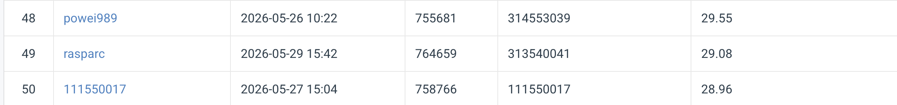

# Ruy Calderon

## Forked From:

[Vaishnav Potlapalli](https://www.vaishnavrao.com/), [Syed Waqas Zamir](https://scholar.google.ae/citations?hl=en&user=POoai-QAAAAJ), [Salman Khan](https://salman-h-khan.github.io/) and [Fahad Shahbaz Khan](https://scholar.google.es/citations?user=zvaeYnUAAAAJ&hl=en)

[](https://arxiv.org/abs/2306.13090)


## Installation and Data Preparation

See [INSTALL.md](INSTALL.md) for the installation of dependencies and dataset preperation required to run this codebase.

## Training

After preparing the training data in ```data/``` directory, use 
```
python train.py
```
to start the training of the model. Use the ```de_type``` argument to choose the combination of degradation types to train on. By default it is set to all the 3 degradation types (noise, rain, and haze).

Example Usage: If we only want to train on deraining and dehazing:
```
python train.py --de_type derain dehaze
```

## Inference
To obtain visual results from the model ```demo.py``` can be used. After placing the saved model file in ```ckpt``` directory, run:
```
python demo.py --test_path {path_to_degraded_images} --output_path {save_images_here}
```
Example usage to run inference on a directory of images:
```
python demo.py --test_path './test/demo/' --output_path './output/demo/'
```
Example usage to run inference on an image directly:
```
python demo.py --test_path './test/demo/image.png' --output_path './output/demo/'
```
To use tiling option while running ```demo.py``` set ```--tile``` option to ```True```. The Tile size and Tile overlap parameters can be adjusted using ```--tile_size``` and ```--tile_overlap``` options respectively.


## Results
Performance in the codabench competition

[]
